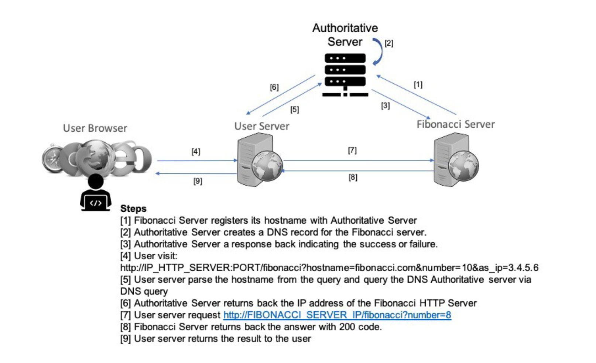

# Simple DNS



This project provides a simple demonstration of how DNS works, featuring three containerized servers:

- **Authoritative Server (AS)** – acts as the DNS server  
- **Fibonacci Server (FS)** – acts as the backend server  
- **User Server (US)** – acts as the client-side server  

The system simulates DNS resolution and service request flow as illustrated in the image above.

Setup instructions are included below.

This project was part of the Data Communication and Networks course (Spring 2025) at NYU Courant, taught by Professor Jean-Claude Franchitti.

## Set Up Instructions

1. **Run all containers**
```bash
docker compose up --build -d
```

2. **Register FS with AS**
```bash
curl -X PUT \
  -H "Content-Type: application/json" \
  -d '{"hostname":"fibonacci.com","ip":"fs","as_ip":"as","as_port":"53533"}' \
  http://localhost:9090/register
```

3. **Send request to US**
```bash
curl "http://localhost:8080/fibonacci?hostname=fibonacci.com&fs_port=9090&number=7&as_ip=as&as_port=53533"
```

4. **Stop and remove all containers**
```bash
docker compose down
```
